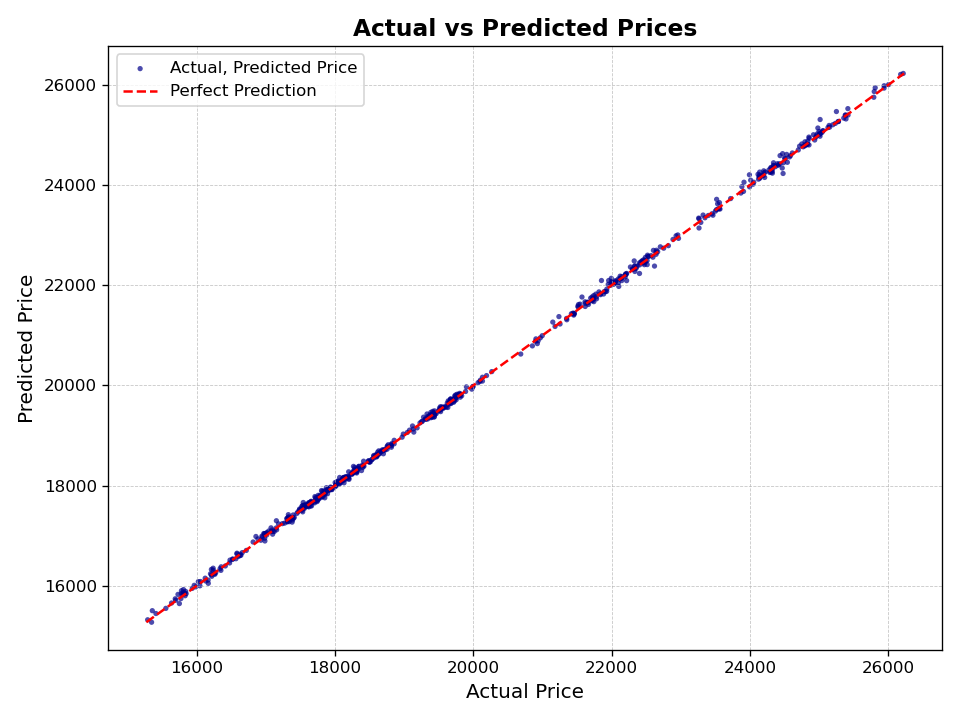
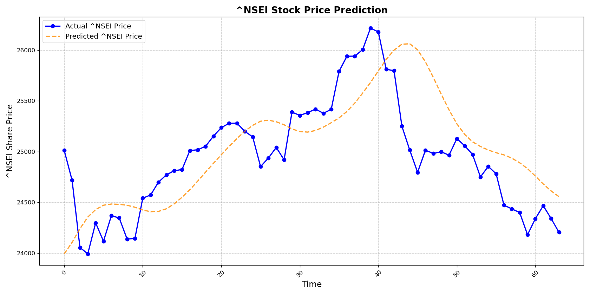

# Stock Market Analysis in Python

[](http://perso.crans.org/besson/LICENSE.html)

[](https://www.python.org/)\
[](https://jupyter.org/try)

The stock market serves as a barometer for a country’s economic well-being, with share prices
influenced by elements like investor sentiment, market trends, and external factors. This project
investigates the potential of machine learning (ML) to predict stock price fluctuations. By analysing
historical data from the NIFTY 50 index (2007–2024), the study examines two ML models— **Linear
Regression** and **Long Short-Term Memory (LSTM)** —to determine their effectiveness in forecasting
market trends and hence forth adding more ideas to it.

## Requirement

Project depends on [Yahoo Finance](https://finance.yahoo.com/) to collect historical data of stock market.

```bash
pip install numpy
pip install pandas
pip install yfinance
pip install keras
pip install scikit-learn
pip install matplotlib
```

## Result

- Plot of prediction using Linear Regression



- Plot of prediction using LSTM


